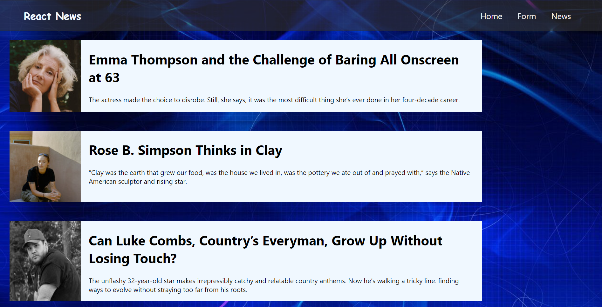

## introduction

React is a JavaScript library that makes it easy to create interactive user interfaces. It is an open source library built by Facebook and is one of the most widely used libraries for building web applications. I am currently learning about this and this is a little project that has helped me developed my skills.

## What are the main objectives of this project?
Understand how to develop an app with React
Improve your web development skills
Improve your JavaScript development skills
Learn to use Context

## Newspaper API

Minimum components:
Header, Home, Form, footer.
News registration form.
Save form in local storage.
After registering you must redirect to ListNews.
ListNews. paint the news.
The design is important.
Use context.
Use SASS.
Make it responsive.

## Screenshots

### React
This has been made using react

### Sass
I have been working using Sass. This is the first time I have implemented Sass into one of my projects.

### Screenshots
Screenshot of the form which will create a news article.

### Postman

### Screenshot of the news API .  

## Thanks to

I want to thank our teachers for their help and pacience with me during this time working on this project.
 [Sofia](https://github.com/SofiaPinilla),[Ger](https://github.com/GeerDev),[Iván](https://github.com/ivanpuebla10)

## Authors

[Alex (@alextebbitt)](https://github.com/alextebbitt) 

## License

This project is licensed under the [Alex Tebbitt](https://github.com/alextebbitt) & License - see the LICENSE.md file for details